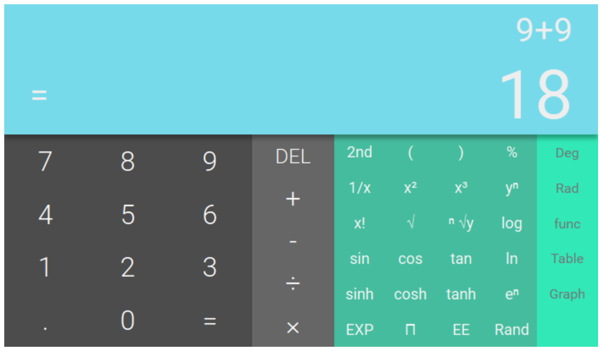

# material-ui-calculator

```javascript
import Calculator from 'material-ui-calculator';
const Demo = () => <Calculator mode="basic"/>
```


Should look something like this when ready: 



# TODOS

* hook up all functions
* display is input
* tab
* tests

